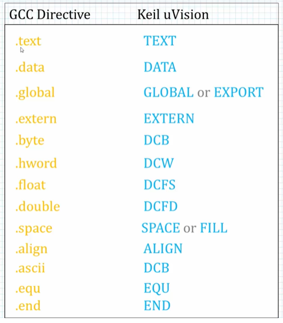

# arm-asm-reference

## Links

[ARM assembler simulator](https://wunkolo.github.io/OakSim)  

</br>

## GNU build command reference

Assemble assemply source file into object file
``` sh
as -o program.o program.s
```

Assemble assemply source file into object file with debugging info
``` sh
as -g -o program.o program.s
```

Link assemble object file into executable
``` sh
ld -o program program.o
```

## GDB command reference

```
Start gdb in UI mode  - gdb --tui <binary_name>
```

``` gdb
q (quit)              - Exit GDB
l (list)              - List source code
i r (info register)   - Examine CPU registers
disas (disassemble)   - Disassemble machine code

b (break)             - Set break point
clear <line_number>   - Remove break point

r (run)               - Run program
stepi                 - Step through instruction
c (continue)          - Continue execution

x                     - Examine memory
x/32b 0x10070         - Examine 32 bytes from address 0x10070
p /d $r1              - Print R1 as signed decimal

```

</br>

### Exiting ASM program

The proper way to finish a program is by calling sys_exit. 
System calls are called "Software Interrupt" command  
The following code is an example of using exit system call:  


``` asm
	.global _start

_start:

	MOV R0,#5     ; Set the parameter for sys_exit
	
	MOV R7,#1
	SWI 0         ; Call sys_exit
```

You can observe the exit code of the last exited command by running:

``` bash
echo $?
```

</br>

### GNU vs Keil Directives

``` text
 .req - Alias for register (foo .req R0).
```


