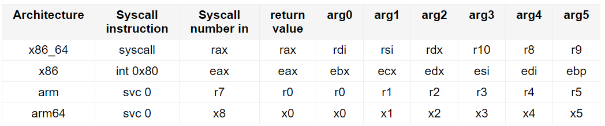

# arm-asm-reference

## Links

### Internal

[Course Content](course/README.md)

### External

[ARM assembler simulator](https://wunkolo.github.io/OakSim)

[system call table per arch](https://chromium.googlesource.com/chromiumos/docs/+/master/constants/syscalls.md)

</br>

## GNU build command reference

Assemble assembly source file into object file
``` sh
as -o program.o program.s
```

Assemble assembly source file into object file with debugging info
``` sh
as -g -o program.o program.s
```

Link assemble object file into executable
``` sh
ld -o program program.o
```

### Exiting ASM program

The proper way to finish a program is by calling sys_exit. 
System calls are called "Software Interrupt" command  
The following code is an example of using exit system call:  


``` asm
	.global _start

_start:

	MOV R0,#5     ; Set the parameter for sys_exit
	
	MOV R7,#1
	SWI 0         ; Call sys_exit
```

You can observe the exit code of the last exited command by running:

``` bash
echo $?
```

</br>

### GNU vs Keil Directives

``` text
.req - Alias for register.
       foo .req R0

.equ - Define a constant.
      .equ BYTES_TO_ALLOCATE, 16
```


</br>

### System-calls calling conventions



</br>

### Interesting topics

[Stack pointer and Frame pointer](https://stackoverflow.com/questions/15752188/arm-link-register-and-frame-pointer#:~:text=The%20stack%20is%20used%20to,or%20locals%20in%20your%20function.&text=So%20the%20sp%20is%20where,a%20data%20aspect%20of%20functions.)