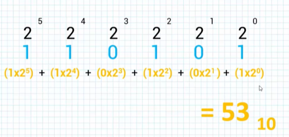
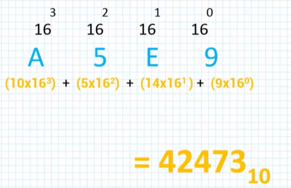
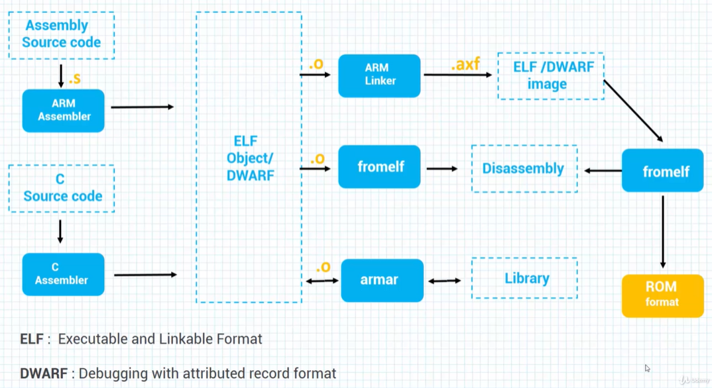
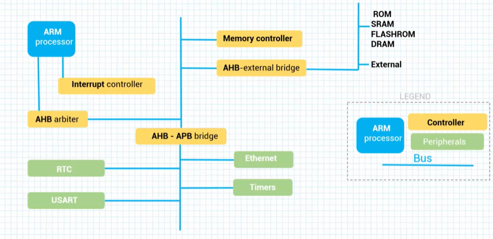
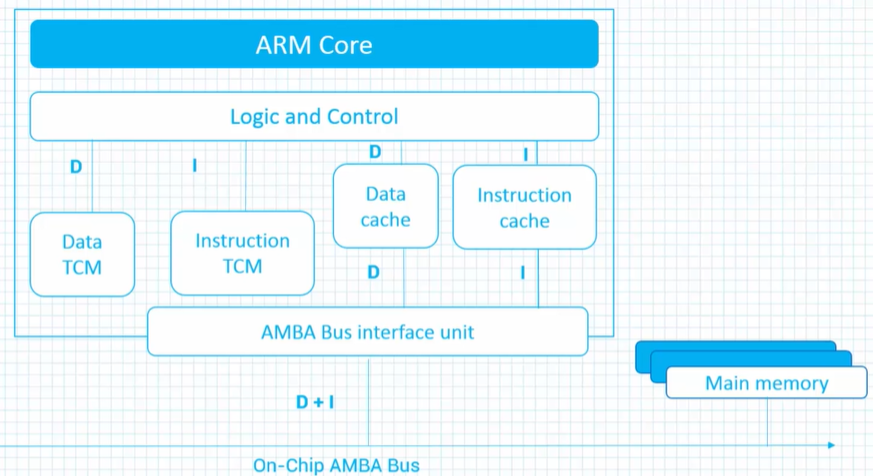

# Intro

## Converting between number systems

Binary to decimal  


Hex to decimal  



## Assembly tools

  

## Assembler syntax

Each assembly command has the following syntax:  
```
Label Opcode Operand ;Comment
```

For example:  
```
store_routine STR R0, [R1] ;Store R0 -> R1 
``` 

<br>

---

## Overall system architecture

  

`APB` - ARM Peripherial bus  
`AHB` - Advanced High Performance Bus  
<br>

## Tightly-Coupled Memory
  
TCM is memory that can be accessd with in a single clock cycle.
One example of TCM usage is using it for interrupt handlers that need deterministic timing and cannot wait for cache misses.

For more info please refer the following link: 
[TCM](https://www.kernel.org/doc/Documentation/arm/tcm.txt) 



<br>

---
