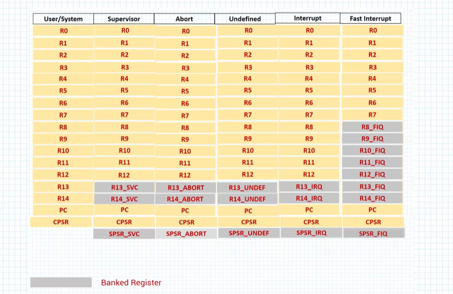
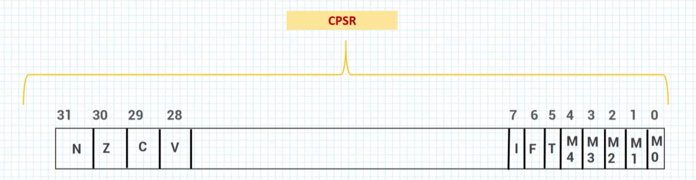
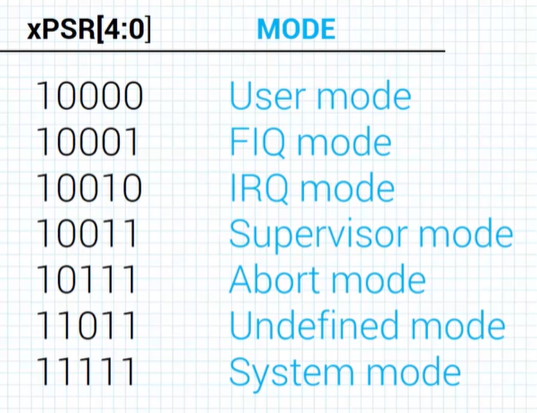
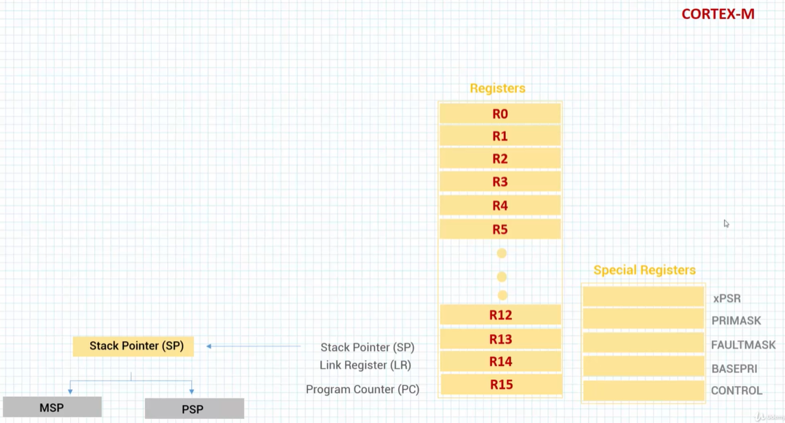
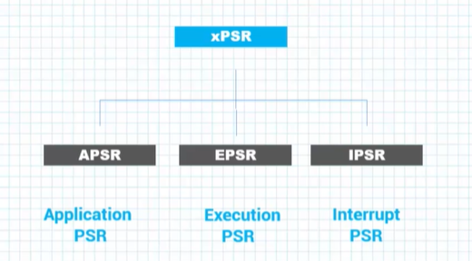
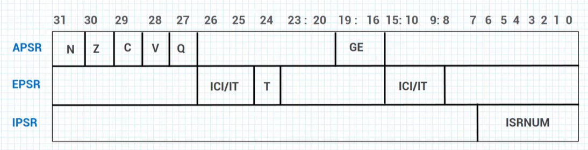
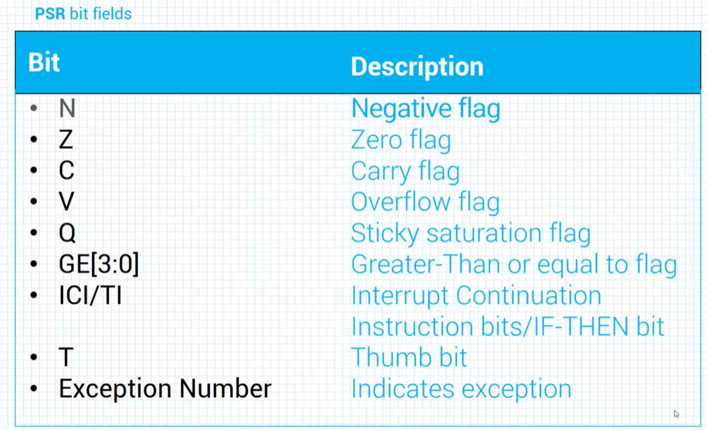
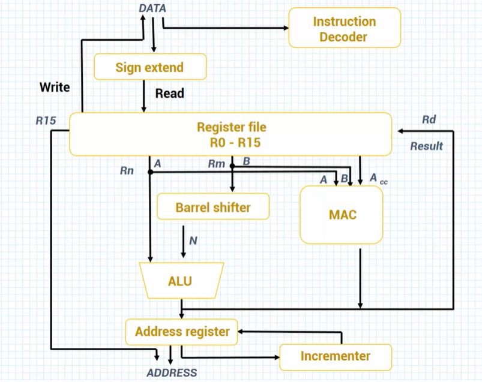
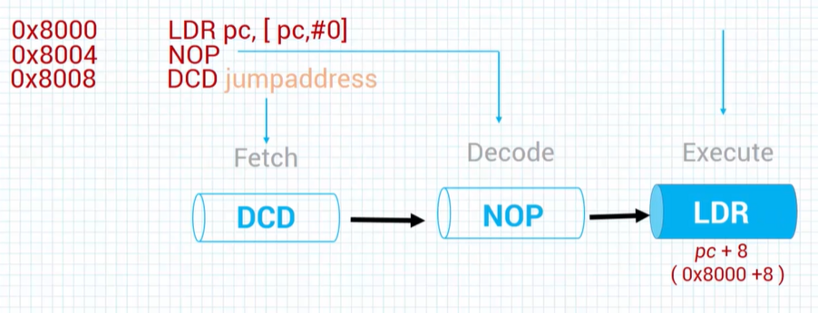

# ARM Architecture

## Data Types

* Byte - 8 bits
* HalfWord - 16 bits
* Word - 32 bits

## ARM7TDMI Registers

On ARM7TDMI processors, there are:
* 30 - General propuse registers
* 6 - Status registers
* 1 - Program counter register 

 

The registers are arranged in partially overlapping banks.   
There is a different register bank for each processor mode.  
The banked registers give rapid context switching for dealing  
with processor exceptions and privileged operations.   

 

Some registers have spacial porpuses:  
* R0 to R12 - General propuse registers
* R13 - Stack Pointer (SP)
* R14 - Linkn Register (LR), stores return locationn for functions
* R15 - Program Counter (PC), containers the current command address plus 4.

CPSR register is the "Current Program Status Register".  

 

Bits [4:0] on CPSR store the current processor mode.

 

## Cortex-M Registers

On Cortex-M processors, there are:
* 17 - General propuse registers
* 1 - Status register
* 3 - Interrupt mask register

 

 

 

 

 

## ARM data flow

ARM is implementing the RISC architecture. Part of RISC  
architecture is the load/store architecture. So ARM processors  
have two instruction types, for transferring data in and out 
of the processor.     

ARM commands can have two source registers (Rn, Rm), and one  
distinationn register (Rd).

Rm register can עם through both Barrel shifer and ALU in sigle instruction.  

  

 

ARM processors implement pipelines with 5 stages.
  

 

The PC register is poinnting on the instruction that is   
currenntly in "Fetch" stage of the pipeline.  

  
