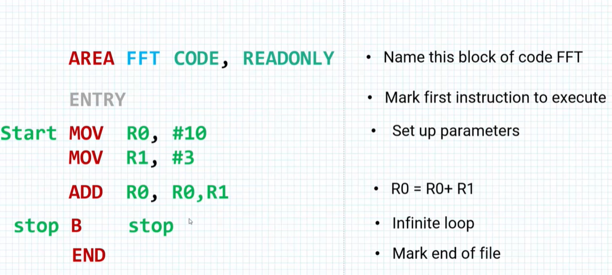
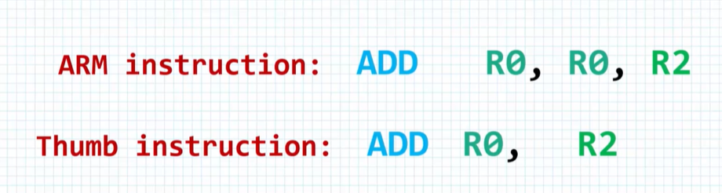
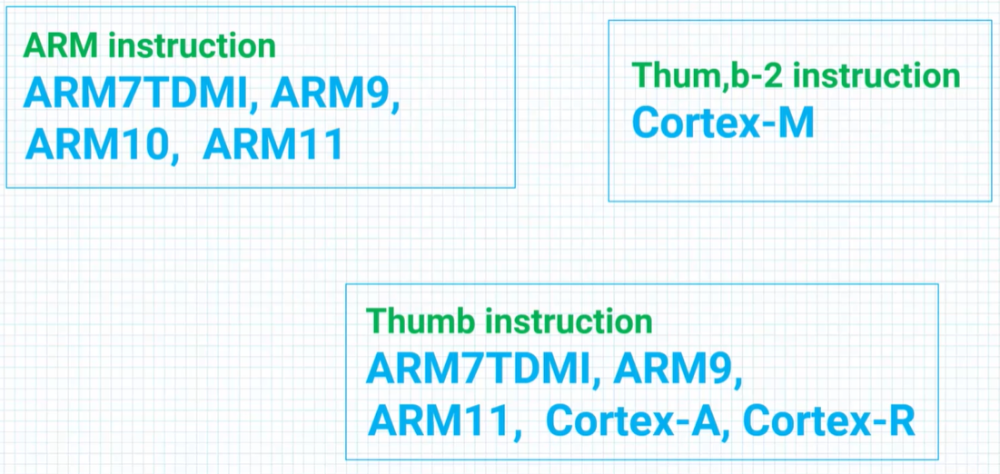
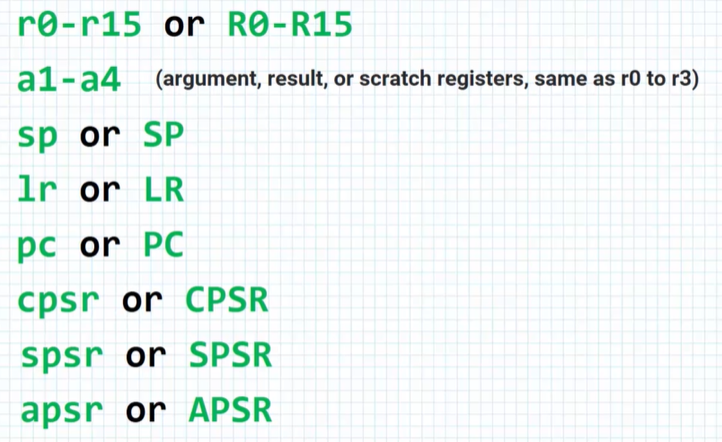
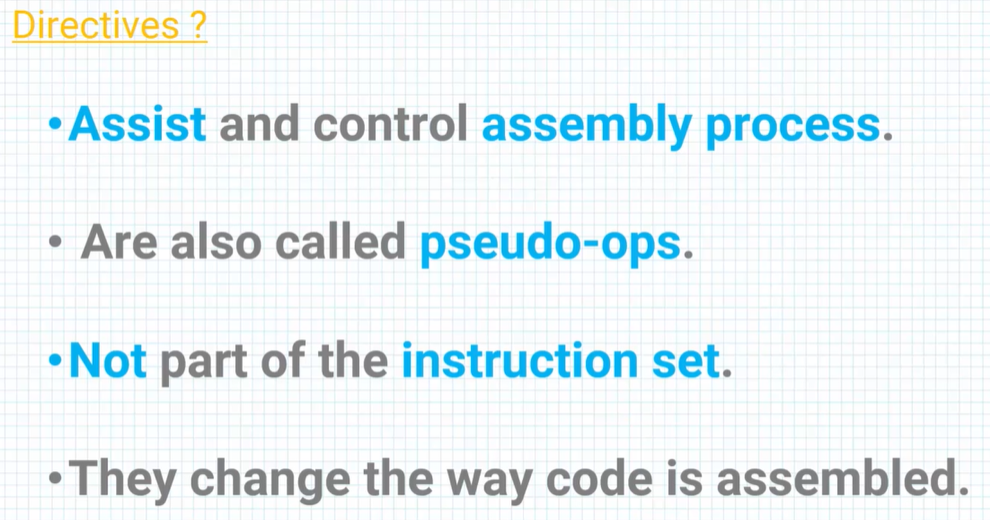
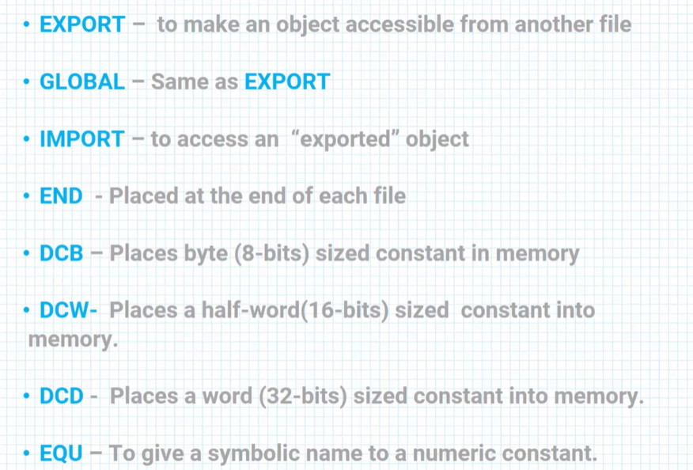
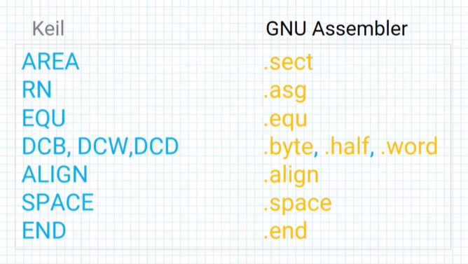
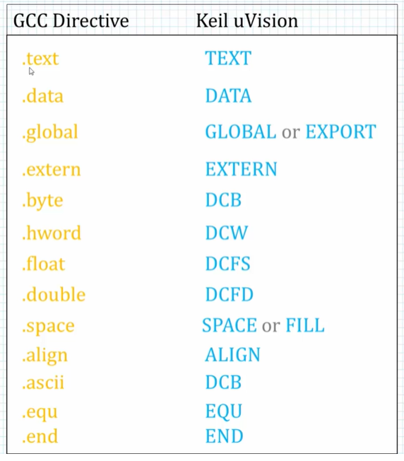
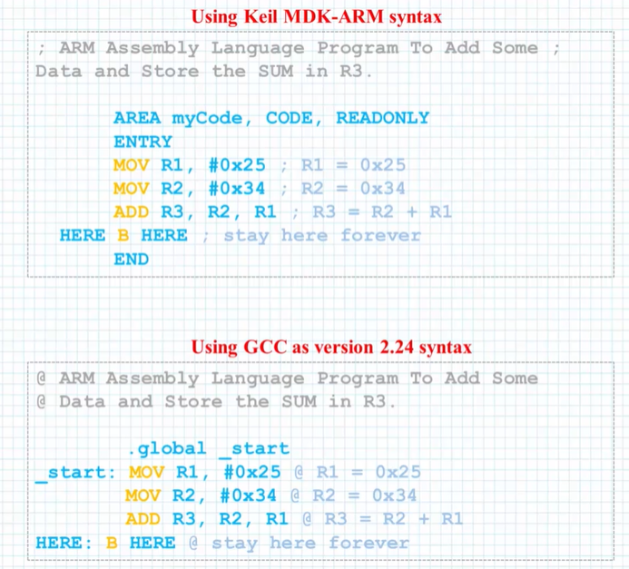

# Rules and directives

## ASM module structure

 

## Thumb and Thumb2 instructions

### Thumb instructions

The ARM command is 32 bits long.
The Thumb command is 16 bits long.

Both instructions are: R0 = R0 + R2.

Thumb 2 is a combination of Thumb 16 bits instructions, and ARM   
32 bit instructions. 

Different processors support different instruction sets.

 

## Registers and Directives

 

Directives are not part of the instruction set.

Examples of directives.    
DCB - Define Constant Byte (8 bits).  
DCW - Define Constant half Word (16 bits).  
DCD - Define Constant Word (32 bits).  

 

Keil and GNU assembers have different names for same directives:  

Comparison of assembly code in Keil and GNU compilers:

