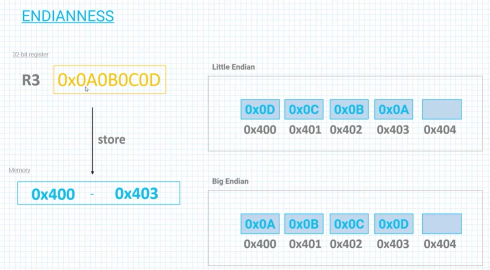

# Load/Store instructions

## Instructions


### LDR
The following image is an example of LDR command usage: 


We load into R9 register the effective address that  
is calculated by the complex expression.  

</br>

### STR

STR instruction can be used to store register value into memory:    


STR instruction can increase the address register:


</br>

### Pre-Indexed addressing

Pre-Indexed addressing is changing the content of register    
containing the address, before the instrucction is done.  

Note the following two instructions:
``` asm
STR R0,[R1, #12]    
STR R0,[R1, #12]!  
```

After the first instruction, R1 will not be modified.  
After the second instruvtion, R1 will be equal to R1+12.

It is important to notice, that the effective address in  
both cases is `R1 + #12`.

</br>

### Post-Indexed addressing

Post-Indexed addressing is changing the content of register    
containing the address, after the instrucction is done.  

``` asm
STR R0, [R1], #12
```

R1 register will change its content to `R1+#12` after   
the instruction is done. The effective address is R1.  

</br>

### Examples of Load Store instructions


</br>

### Endianess
ARM processors are `little endian`.



</br>

### Data Areas


