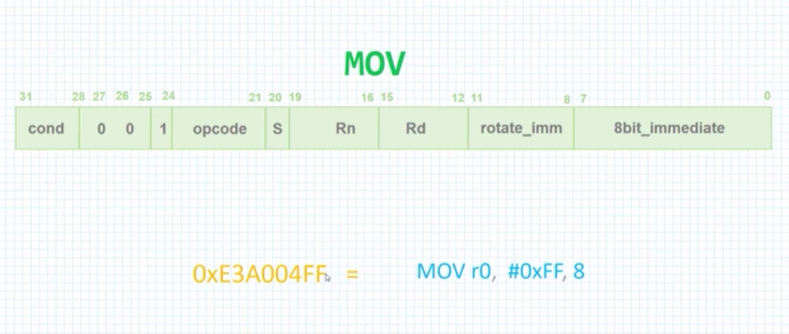

# Constants and liternal pools

## MOV with IMM value



In the example above, we want to move "#0xFF<<8" into R0 register.  
The OpCode of this command is 0xE3A00AFF.

The last byte (0xFF) is the immidiate value.  
Bits 8 to 11 contain the rotate immidiate devided by 2.  
In this case, since we want to rotate 0xFF by 8, the value   
of rotate_imm is 8/2=4.  

</br>

## LDR for constants

The following code is an example of loading the BASE_ADDR  
constant into R1 register.  

Note that the '.equ' directive is used to give a symbolic name  
BASE_ADDR to the numeric value of 0x04000000.  


``` asm
	.global _start

	.equ  BASE_ADDR, 0x04000000

_start:

	LDR R1, =BASE_ADDR
	
	MOV R7,#1
	SWI 0
```

</br>

## Loading constants with ADR and ADRL

Both ADR and ADRL instructions used to load adress into register.  

``` asm
ADR  <Rd>, label  
ADRL <Rd>, label  
```

ADR is used for addresses in small offset from the current PC.   
ADRL is used for addresses in medium offset from the current PC.    

</br>

## Loading memory from constant 

The following code example, defines constant memory range,  
and loads values from this range into registers using offsets.  

``` asm
	.global _start

_start:

	ADRL R4, ConstValues   // R4 is the address of ConstValues
	
	LDR R0, [R4, #4]       // R0 = ConstValues[4] = 5
    LDR R1, [R4, #8]       // R1 = ConstValues[8] = 4

	ADD R2, R0, R1         // R2 = 5 + 4

	MOV R7,#1
	SWI 0


ConstValues:   .space 4     // Empty 4 bytes
               .word 5
               .word 4
               .align       // Allign memory by multiples of 4
              
```

If we exammine the ConstValues(0x10070) memory, we get the following  values:

``` gdb

(gdb) x/32b 0x10070
0x10070 <ConstValues>:  
0x00    0x00    0x00    0x00    0x05    0x00    0x00    0x00

0x10078 <ConstValues+8>: 
0x04    0x00    0x00    0x00    0x41    0x11    0x00    0x00

0x10080: 
0x00    0x61    0x65    0x61    0x62    0x69    0x00    0x01

```
