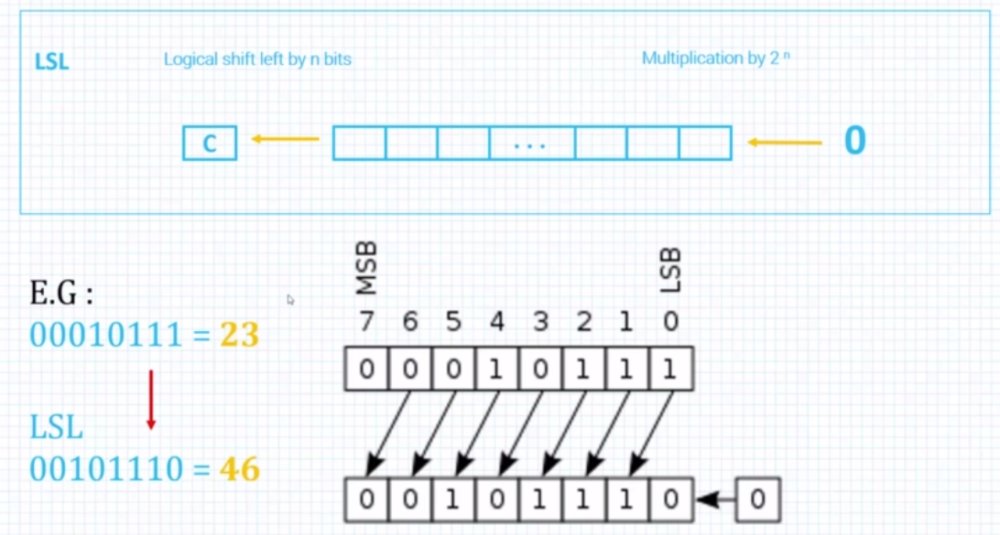
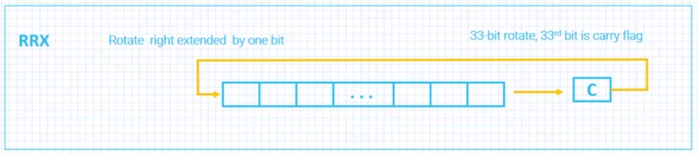

# Arithmetic And Logic Instructions

## Status registers


</br>

## N flag 

Negative, indicates that the result is negative.  
Since machines are working in "2 complements", number is  
negastive if its most significant bit is 1.  

</br>

## V flag 

Signed overflow flag. Indicates that the result of arithmetic   
instruction is greater thatn 2^31 or smaller than 2^-31.

</br>

## Z flag

Indicates that the result of an operation is zero.  

</br>

## C flag

The carry flag indicates that the result is greater than 2^32.  

</br>

## Relevant instruciotns

``` text
CMP - Subtract register or imm and update status register.
CMN - Add register or imm and update status register.

TST - Logically ANDs value with register and update status reg.  
TEQ - Logically XORs value with register and update status reg.  

MRS - Move PSR into general porpuse register.
MSR - Move general porpuse register into PSR.

```
</br>

Note - TST and TEQ are not affecting the V flag.


</br>

## ADD vs ADDS

Arithmetic instructions (ADD, SUB, etc) don't modify the status    flag, unlike comparison instructions (CMP,TEQ) which update the   condition flags by default.   
However, adding the S to the arithmetic instructions(ADDS, SUBS,  etc) will update the condition flags according to the result of the operation.  

</br>

## Boolean operations


</br>

## Shift operations

Imporntant note is that logical shift is working only  
on positive numbers. Arithmetic shift must be used on signed  
negative numbers.

`Logical Shift` - Do not preserves the sign of the number.  
`Arithmetic Shift` - Preserves the sign of the number.  

</br>


### Logical left shift


### Logical right shift


### Arithmetic right shift

Arithmetic shifts are preserving the sign on the number.


### Rotate right


### Rotate right extended
Rotate by a single bit, and place the LSB in the carry flag.  



</br>

## ADD and SUB instructions

Note that RSB is Reverse Subtract.


</br>

## ADD and SUB instructions for 64 bit numbers

The following code adds two 64 bit intagers stored in  
R0,R1 and R2,R3 and stores the sum in R4,R5.


## Example: Max value from data set

This program will place in R1 the max number from DataSet.

```
	.global _start

DataSet:   .word 1,5,3,2,9,0,4,7

NEXT      .req R0
MAX_VAL   .req R1
COUNT     .req R2
DATA_PTR  .req R3


_start:

        LDR DATA_PTR, =DataSet
        MOV COUNT, #7
        LDR MAX_VAL, [DATA_PTR]

LOOP:
        
        ADD DATA_PTR, DATA_PTR, #4
        
        LDR NEXT, [DATA_PTR]
        CMP NEXT, MAX_VAL    
        BHI VALUE_IS_LARGER

CONTROL: 

        SUBS COUNT, COUNT, #1
        BEQ END
        B LOOP

        
VALUE_IS_LARGER:

        MOV  MAX_VAL, NEXT
        B CONTROL
 	

END:

        MOV R7,#1
        SWI 0

```