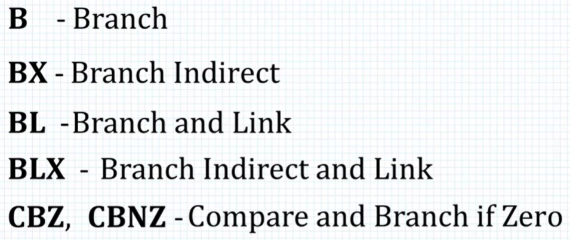
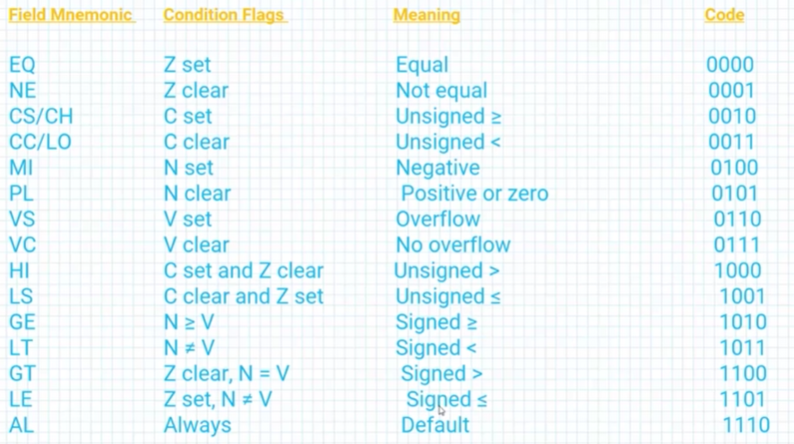
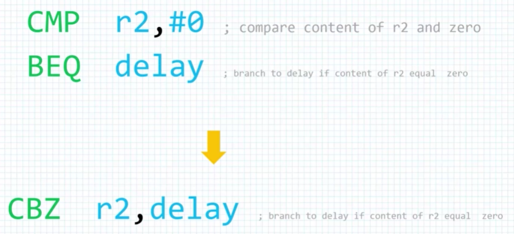

# Branch and loop instructions

## Branching instructions

Note that BL will update the link register (R14).  
This is useful when calling a subroutine, and we need to  
store the return address.  

We can append commands to the B command and get conditional  
branching command.  
For example: B + EQ = BEQ (Branch if equal).

Compare and Bruch instructions are helpful in loops;  

